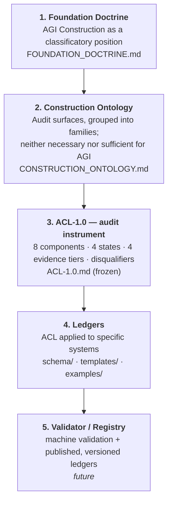

# Architecture — The AGIConstructor Reference Layer

**How the parts of this asset relate. Read top to bottom: each layer presupposes the one above it.**

Status: Foundation document
Issued: 2026-08-03
Maintainer: Sohadot

---

## The layer stack

If Mermaid does not render, the stack is:

**Foundation Doctrine → Construction Ontology → ACL-1.0 audit instrument → Ledgers → Validator / Registry (future).**

## What each layer contributes

| Layer | File(s) | Contributes | Status |
|---|---|---|---|
| 1. Foundation Doctrine | [`FOUNDATION_DOCTRINE.md`](./FOUNDATION_DOCTRINE.md) | *Why* construction is a classificatory position, not a prediction; the AGIConstructor↔ACL relationship; the three distinctions; independence from safety and capability | Published |
| 2. Construction Ontology | [`CONSTRUCTION_ONTOLOGY.md`](./CONSTRUCTION_ONTOLOGY.md) | *What kinds* of audit surface exist, grouped into families; that they are neither necessary nor sufficient conditions | Published |
| 3. ACL-1.0 instrument | [`ACL-1.0.md`](./ACL-1.0.md) | *How* to classify one system, component by component, with states, tiers, and disqualifiers | **Frozen — do not modify** |
| 4. Ledgers | [`schema/`](./schema/), [`templates/`](./templates/), [`examples/`](./examples/) | *The record* — machine-readable schema, blank templates, and one worked illustrative example | Published |
| 5. Validator / Registry | — | Machine validation of ledgers and a versioned public registry of published results | **Future** — not built |

## The three distinctions, mapped to layers

The [Foundation Doctrine §4](./FOUNDATION_DOCTRINE.md) requires three things never to collapse. The stack preserves them:

- **What exists in a system** — addressed by the Ontology (layer 2): the surfaces where construction *could* be examined.
- **What is publicly evidenced** — addressed by ACL-1.0's evidence tiers (layer 3): the subset that is disclosed or reproduced, and how strongly.
- **What the instrument can classify** — addressed by ACL-1.0's states and disqualifiers (layer 3) and enforced mechanically by the schema (layer 4).

A ledger (layer 4) reports only the intersection of the three. The future registry (layer 5) will make published ledgers comparable and versioned without ever converting a record into a verdict.

## Boundaries between layers

- **Layers 1–2 are foundational and interpretive.** They explain and organize. They never classify a system and never alter the instrument.
- **Layer 3 is frozen.** ACL-1.0 is published. Limitations surfaced by layers 1–2 are recorded in [`ACL-2.0-CANDIDATES.md`](./ACL-2.0-CANDIDATES.md), not retrofitted here.
- **Layer 4 is faithful to layer 3.** The schema and templates encode exactly ACL-1.0's eight components, four states, and four tiers — no additional states, no split axes, no new methodology.
- **Layer 5 does not yet exist.** No claim is made that it does.
